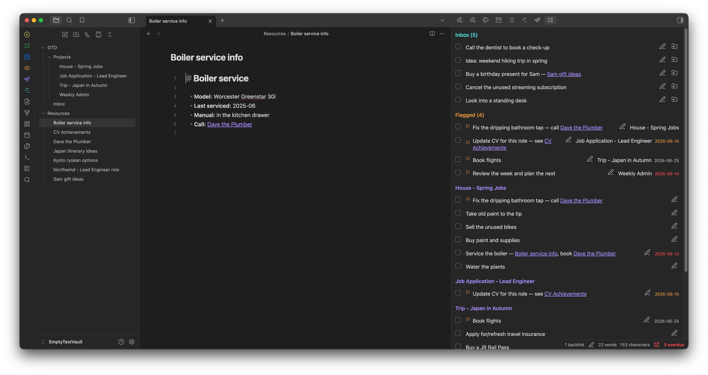
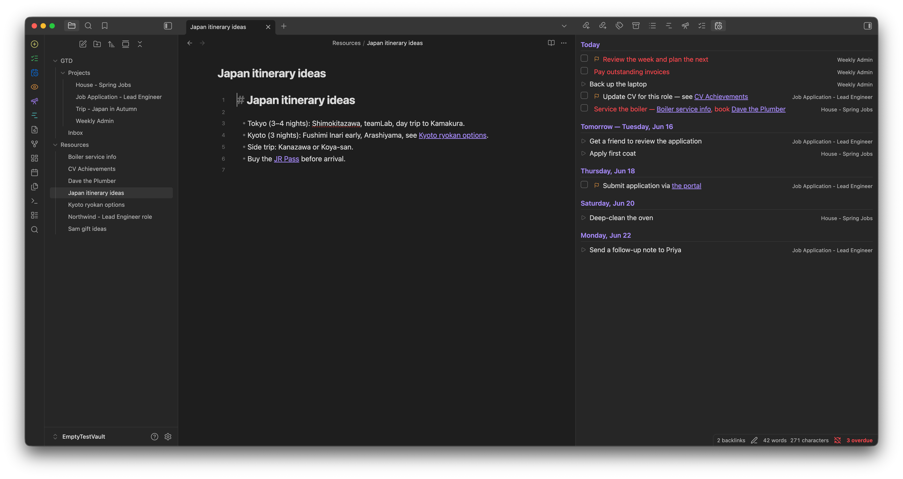
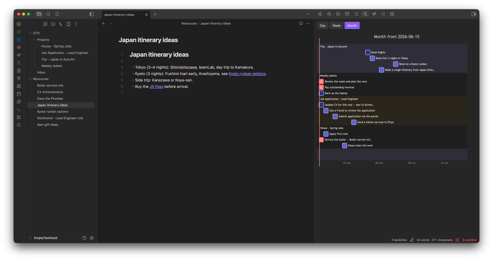
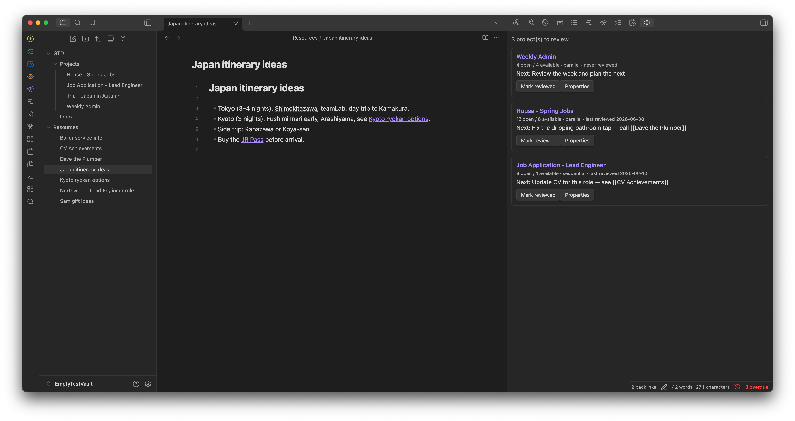
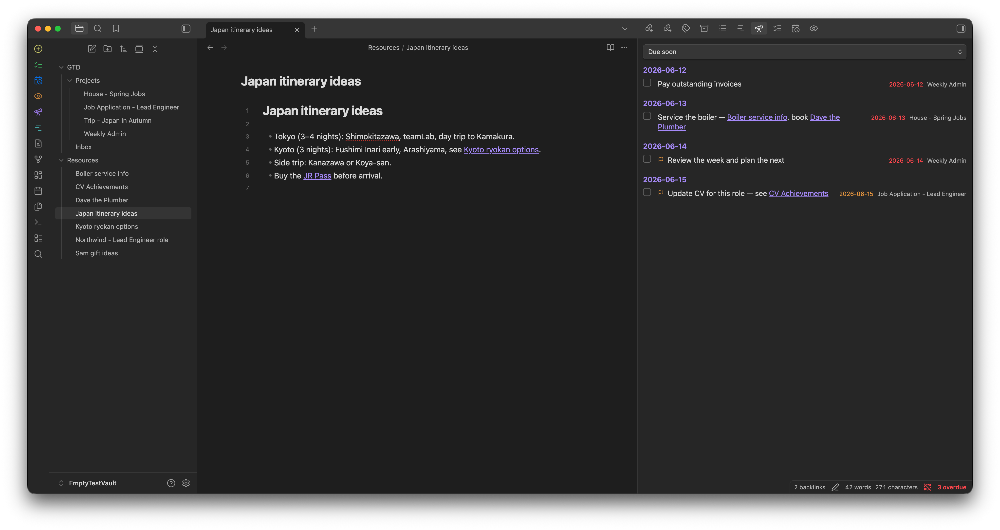
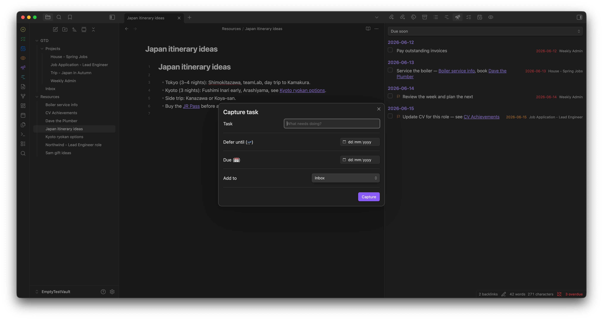

# GTD Flow

**Structured, GTD-style task management for [Obsidian](https://obsidian.md), built on plain Markdown.**

GTD Flow brings serious project structure — sequential and parallel projects, defer dates, next-action availability, forecast, and review — to your Obsidian vault, while keeping every task as a normal checklist line in your own notes. There is no hidden database: your Markdown is the source of truth, and the tasks stay readable (and editable) even with the plugin turned off.

It speaks the [Tasks plugin](https://publish.obsidian.md/tasks) emoji syntax, so the two can share the same files.

---

## Screenshots

| Next actions | Forecast | Timeline |
|---|---|---|
|  |  |  |

| Review | Perspectives | Capture |
|---|---|---|
|  |  |  |

---

## Why GTD Flow

- **Your notes stay yours.** Projects are ordinary Markdown notes; tasks are ordinary `- [ ]` lines. Greppable, portable, Git-friendly, and fully usable without the plugin.
- **Real next-action logic.** A task is *available* only when its project is active, its defer date has passed, and — in sequential projects — everything before it is done.
- **Action groups.** Indent tasks to nest them; a group with open children isn't actionable until those children are finished.
- **One pane for the day.** Forecast and a Mermaid-powered Gantt timeline (day / week / month) show what's due and what's coming.
- **Capture without friction.** A quick-capture modal, a global command, and an `obsidian://gtd-capture` URL for grabbing tasks from anywhere.
- **Stays out of the way.** Flags, durations, repeats, perspectives, archiving, and per-project page colors — use as much or as little as you like.

## Core ideas

| Concept | GTD Flow |
|---|---|
| Project | A note with `type: project` frontmatter |
| Sequential / parallel | `flow:` key (overridable per action group) |
| Defer / Due | 🛫 / 📅 on the task line |
| Flag | a tag (default `#flag`) |
| Someday / Maybe | `status: someday` projects and a `#someday` tag for single tasks |
| Contexts | hierarchical tags (`#home/plumbing`), filterable in perspectives |
| Forecast | Forecast + Timeline views |
| Review | per-project interval + a review queue |
| Inbox | a capture note you triage into projects |

## Feature highlights

- Sequential/parallel **projects** with nested **action groups**
- **Defer, due, time of day (⏰), duration (⏱), repeat (🔁)** on tasks, with inline auto-suggest (natural-language dates: "Thursday", "end of week"…)
- **Task statuses** — to-do, in-progress `[/]`, done, dropped `[-]` — with **💬 closure reasons**
- **Edit right in the note** — right-click menu on task lines and checkbox clicks that record ✅ and the 🔁 next occurrence, no Tasks plugin needed
- **Next Actions**, **Forecast**, **Timeline** (Gantt), **Review**, and **Perspectives** views, with **drag-to-reorder** in Forecast/Perspectives
- **Quick capture** (modal, command, and URL handler) and **inbox triage** into projects
- **Repeat-on-complete**, **flags**, **someday/maybe**, **archiving**, an **overdue badge**, and due-task **notifications**
- **Done queries** — a `gtd-done` block that lists what you closed in any period (presets, project/folder filters), plus an exportable report note
- **In-note highlighting** of next/available/blocked/deferred/overdue tasks, plus an opt-in per-project **status block**
- **Per-project page styling** (tint/banner) and project pills matching your **file-explorer colors**

## Install

Until the community-directory listing is live, install with [BRAT](https://github.com/TfTHacker/obsidian42-brat): add this repository as a beta plugin, then enable **GTD Flow** in *Settings → Community plugins*. Works on desktop and mobile.

Manual install: download `main.js`, `manifest.json`, and `styles.css` from a [release](../../releases) into `<vault>/.obsidian/plugins/gtd-flow/` and enable the plugin.

## Quick start

1. Set your projects folder and inbox note in the plugin settings (defaults: `GTD/Projects`, `GTD/Inbox.md`).
2. Run **GTD Flow: New project**, or right-click the projects folder → **New GTD project**.
3. Add tasks as `- [ ]` lines; type at the end of a line for the date/duration/repeat suggester.
4. Open **Next actions** from the ribbon and start working.

## Documentation

Full usage, syntax, settings, and architecture: **[INSTRUCTIONS.md](INSTRUCTIONS.md)**.

## License

[MIT](LICENSE) © Marco Guidetti
